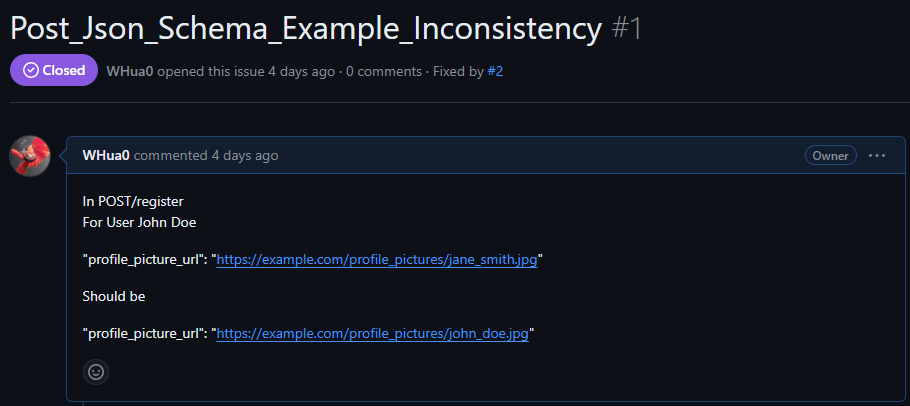
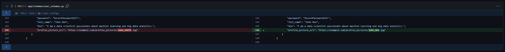
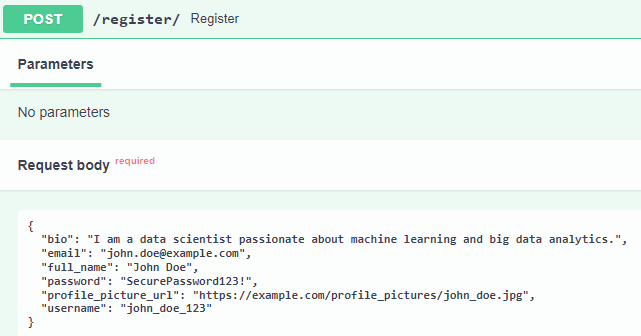
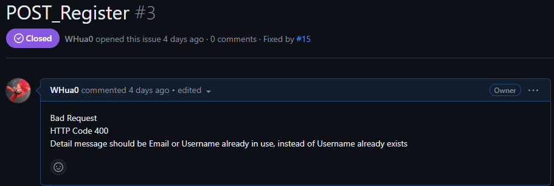
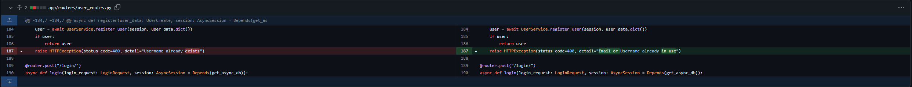

# Event Manager Practice

## Closed Issues
Github Issue Image Placeholder

[Github Closed Issues Link](https://github.com/WHua0/event_manager_practice/issues?q=is%3Aissue+is%3Aclosed)

### Closed Issue 1: Settings Max Login Attempts Description is Incorrect

Github Issue Image Placeholder

[Github Issue 1 Link](https://github.com/WHua0/event_manager_practice/issues/10)

Github Code Modifications Placeholder

Github Test Codes Placeholder

Documentation

### Closed Issue 2: Username Validation (TBD)
Github Issue Image Placeholder

Github Issue 2 Link

Github Code Modifications Placeholder

Github Test Codes Placeholder

Documentation

### Closed Issue 3: Password Validation is Missing No Spaces Allowed and Max Length
Github Issue Image Placeholder

[Github Issue 3 Link](https://github.com/WHua0/event_manager_practice/issues/4)

Github Code Modifications Placeholder

Github Test Codes Placeholder

Documentation

### Closed Issue 4: Email Validation is Missing Max Length

Github Issue Image Placeholder

[Github Issue 4 Link](https://github.com/WHua0/event_manager_practice/issues/8)

Github Code Modifications Placeholder

Github Test Codes Placeholder

Documentation

### Closed Issue 5: Profile Picture Url Validation is missing Max Length, HTTPS/HTTP protocol, and Valid Domain 

Github Issue Image Placeholder

[Github Issue 5 Link](https://github.com/WHua0/event_manager_practice/issues/7)

Github Code Modifications Placeholder

Github Test Codes Placeholder

Documentation

### Closed Issue 6: POST/register JSON Schema Example is Inconsistent

[Github Issue 6 Link](https://github.com/WHua0/event_manager_practice/issues/1)

In POST/register Register request body, the test user is John Doe, however the test profile picture url is for Jane Smith. For consistency, the class Config in class UserBase in user_schemas.py is corrected to reflect the test profile picture url of John Doe.

### Closed Issue 7: POST/register HTTP 400 Detail Message is Missing Email Already In Use

[Github Issue 7 Link](https://github.com/WHua0/event_manager_practice/issues/3)

Documentation

### Closed Issue 8: POST/users Create User is Missing HTTP 400 and Detail Message for Email Already In Use

Github Issue Image Placeholder

[Github Issue 8 Link](https://github.com/WHua0/event_manager_practice/issues/12)

Github Code Modifications Placeholder

Github Test Codes Placeholder

Documentation

### Closed Issue 9: POST/users Get User is Missing Return Values for Full Name, Bio, and Profile Picture Url

Github Issue Image Placeholder

[Github Issue 9 Link](https://github.com/WHua0/event_manager_practice/issues/9)

Github Code Modifications Placeholder

Github Test Codes Placeholder

Documentation

### Closed Issue 10: POST/users Get Users is Missing HTTP 400 for Skip Integer Less Than 0, and Limit Integer Less Than or Equal to 0

Github Issue Image Placeholder

[Github Issue 10 Link](https://github.com/WHua0/event_manager_practice/issues/5)

Github Code Modifications Placeholder

Github Test Codes Placeholder

Documentation

### Closed Issue 11: PUT/users Update User is Not Functional

Github Issue Image Placeholder

[Github Issue 11 Link](https://github.com/WHua0/event_manager_practice/issues/6)

Github Code Modifications Placeholder

Github Test Codes Placeholder

Documentation

## Dockerhub
Dockerhub Image Placeholder

Dockerhub Link 

## Pytest Coverage
Pytest Coverage Image Placeholder

## Reflection
Documentation